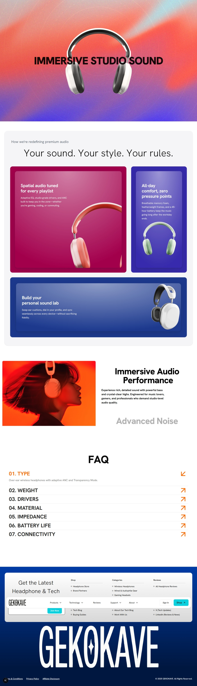

# GekoKave



## Overview
GekoKave is a modern, high-performance landing page built with Next.js and Tailwind CSS. It features a sleek design with advanced animations and interactive components to provide an engaging user experience.

## Features
- **Responsive Design**: Fully optimized for all device sizes.
- **Modern Animations**: Powered by Framer Motion (Motion) for smooth transitions.
    - **Gradual Spacing**: Animated text headers.
    - **Sticky Scroll Reveal**: Dynamic content presentation.
- **Interactive Components**:
    - **Hero Section**: Engaging introduction.
    - **Product Showcase**: Highlight key offerings.
    - **FAQ Section**: User-friendly accordion-style questions.

## Tech Stack
- **Framework**: [Next.js](https://nextjs.org/)
- **Styling**: [Tailwind CSS](https://tailwindcss.com/)
- **Animation**: [Motion](https://motion.dev/)
- **Icons**: [Lucide React](https://lucide.dev/)

## Getting Started

### Prerequisites
Make sure you have Node.js installed on your machine.

### Installation

1. Clone the repository:
   ```bash
   git clone <repository-url>
   ```

2. Install dependencies:
   ```bash
   npm install
   ```

3. Run the development server:
   ```bash
   npm run dev
   ```

4. Open [http://localhost:3000](http://localhost:3000) with your browser to see the result.

## Scripts
- `npm run dev`: Starts the development server.
- `npm run build`: Builds the application for production.
- `npm start`: Runs the built application in production mode.
- `npm run lint`: Runs ESLint to check for code quality issues.
